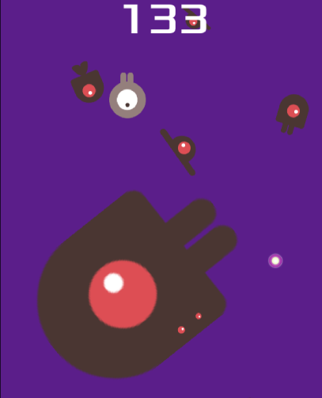

# Dodge the Creeps
 Godot starter project. This is a simple game; the goal is to move the player character around, collect glowing orbs, and dodge the spawning enemy mobs. Each orb you collect and each second you survive increases your score. Touch an enemy mob and it's game over. Try to survive for as long as you can!
 
 

 Adapted from the Godot documentation [getting started tutorial](https://docs.godotengine.org/en/stable/getting_started/first_2d_game/index.html). 

 ## How to Play
Play directly from GitHub Pages:

[Launch Game](https://stomobe.github.io/Dodge-the-Creeps/Dodge-the-Creeps.html)


 Or, clone this repository to your local files. To run the game, serve the file 'Dodge the Creeps.html' to your browser.

 A simple way to do so is to navigate to the project root directory, start a Linux terminal, and run the following:
 ```
 python3 -m http.server
```
 This will start serving the project directory to a local port, usually by default port 8000.
 
 Then, in your web browser, navigate to your port (ie. http://localhost:8000). Finally, select the file 'Dodge the creeps.html' to open the game.

 ## Controls
 | Action | Input |
| --- | --- |
| Movement | WASD keys or arrow keys |
| Start | click the "Start" button or press Enter key |
| Pause | Esc key or Space key |
| Set Difficulty | from Pause screen, toggle "Easy," "Normal," or "Hard" buttons |
